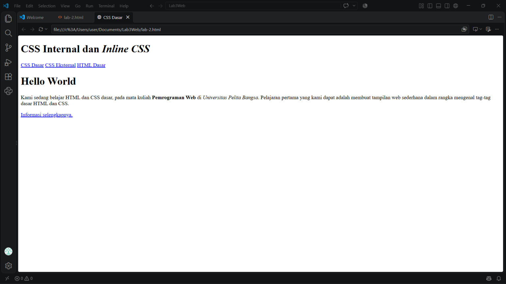
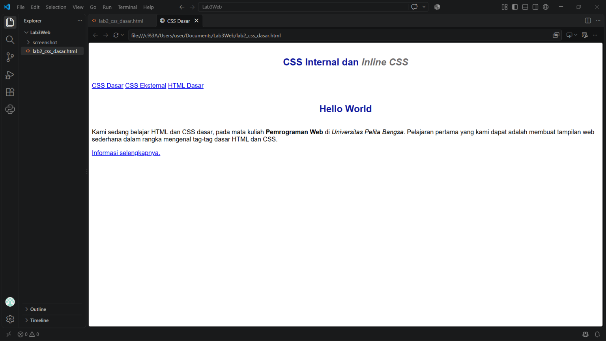
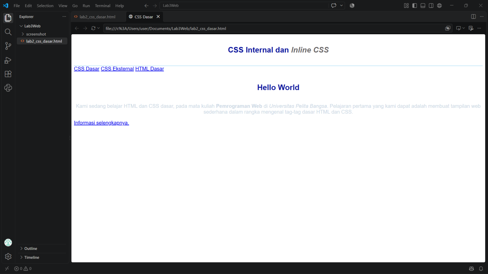
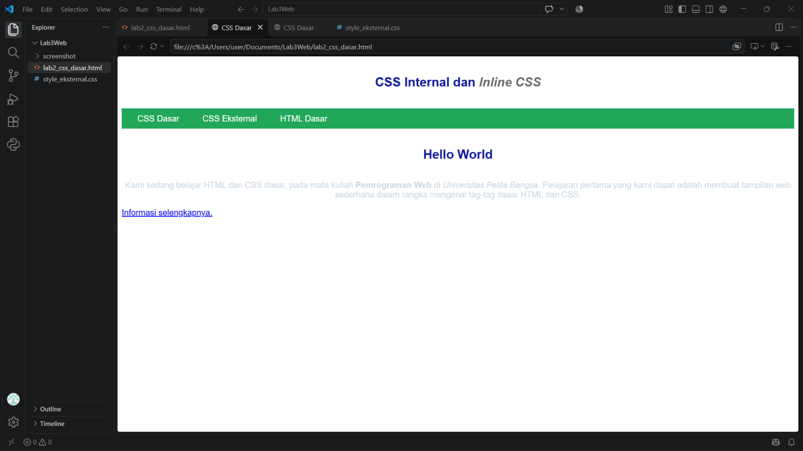
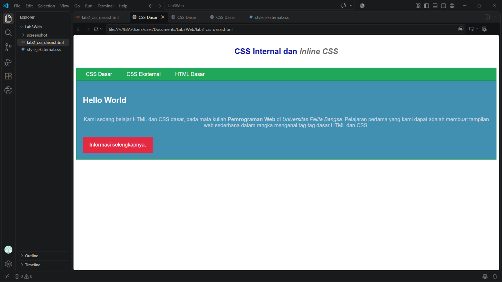
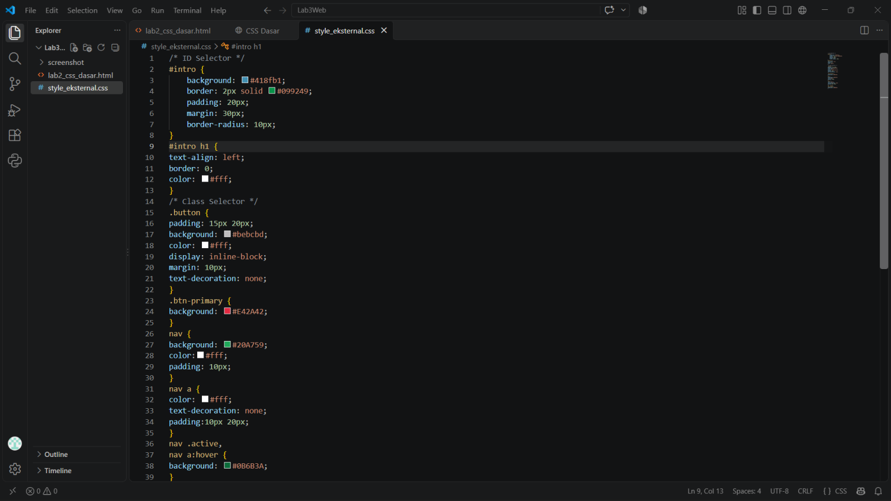
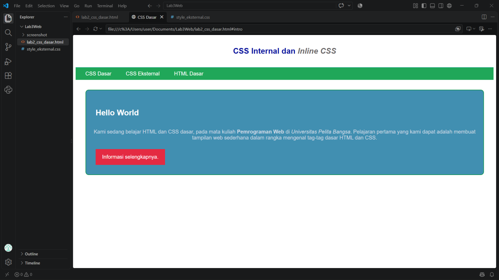

# LAPORAN PRAKTIKUM 3 — CSS DASAR

**Nama:** [Nama Anda]
**NIM:** [NIM Anda]
**Kelas:** [Kelas Anda]
**Mata Kuliah:** Pemrograman Web

---

## 1. Membuat Dokumen HTML

Pada langkah pertama dibuat dokumen HTML dengan nama `lab2_css_dasar.html`. Dokumen dibuat menggunakan struktur dasar HTML dan berisi bagian `header`, `nav`, serta konten halaman.

### Screenshot



---

## 2. Mendeklarasikan CSS Internal

Pada langkah kedua ditambahkan CSS secara internal menggunakan tag `<style>` pada bagian `<head>` dokumen HTML.

CSS digunakan untuk mengatur tampilan `body`, `header`, `h1`, dan elemen lainnya.

Contoh:

```html
<style>
    body {
        font-family: 'Open Sans', sans-serif;
    }

    header {
        min-height: 80px;
        border-bottom: 1px solid #77CCEF;
    }

    h1 {
        font-size: 24px;
        color: #0F189F;
        text-align: center;
        padding: 20px 10px;
    }

    h1 i {
        color: #6d6a6b;
    }
</style>
```

### Screenshot



---

## 3. Menambahkan Inline CSS

Pada langkah ketiga ditambahkan CSS secara inline pada elemen `<p>`.

Contoh:

```html
<p style="text-align: center; color: white;">
    Kami sedang belajar HTML dan CSS dasar.
</p>
```

CSS inline ditulis langsung sebagai atribut pada tag HTML sehingga pengaturannya diterapkan langsung pada elemen tersebut.

### Screenshot



---

## 4. Membuat CSS Eksternal

Pada langkah keempat dibuat file CSS eksternal dengan nama `style_eksternal.css`.

File tersebut kemudian dihubungkan dengan dokumen HTML menggunakan tag:

```html
<link rel="stylesheet" href="style_eksternal.css" type="text/css">
```

Dengan menggunakan CSS eksternal, aturan CSS ditulis secara terpisah dari dokumen HTML.

### Screenshot



---

## 5. Menambahkan CSS Selector

Pada langkah kelima ditambahkan CSS Selector menggunakan **Element Selector, ID Selector, dan Class Selector**.

### Element Selector

```css
nav {
    background: #20A759;
    color: #fff;
}

nav a {
    color: #fff;
    text-decoration: none;
}
```

Element selector digunakan berdasarkan nama tag HTML.

### ID Selector

```css
#intro {
    background: #418fb1;
    border: 1px solid #099249;
    min-height: 100px;
    padding: 10px;
}
```

ID selector menggunakan tanda `#` sebelum nama ID.

### Class Selector

```css
.button {
    padding: 15px 20px;
    background: #bebcbd;
    color: #fff;
}

.btn-primary {
    background: #E42A42;
}
```

Class selector menggunakan tanda `.` sebelum nama class.

### Screenshot



---

# 6. Jawaban Pertanyaan dan Tugas

## Pertanyaan 1

**Lakukan eksperimen dengan mengubah dan menambah properti dan nilai pada kode CSS.**

### Jawaban

Eksperimen dilakukan dengan mengubah dan menambahkan beberapa property dan value CSS, seperti `background`, `color`, `padding`, `margin`, `border`, `border-radius`, `font-size`, `font-weight`, dan `text-align`.

Contohnya:

```css
#intro {
    background: #418fb1;
    border: 2px solid #099249;
    padding: 20px;
    margin: 30px;
    border-radius: 10px;
}
```

Perubahan property dan value tersebut menyebabkan perubahan pada tampilan elemen HTML.

### Screenshot




---

## Pertanyaan 2

**Apa perbedaan pendeklarasian CSS elemen `h1 {...}` dengan `#intro h1 {...}`?**

### Jawaban

`h1 { ... }` merupakan **Element Selector**. Selector tersebut digunakan untuk memberikan aturan CSS pada elemen `<h1>`.

Sedangkan `#intro h1 { ... }` merupakan selector yang menggabungkan **ID Selector** dan **Element Selector**. Selector tersebut hanya diterapkan pada elemen `<h1>` yang berada di dalam elemen dengan `id="intro"`.

Contoh:

```css
h1 {
    color: blue;
}

#intro h1 {
    color: white;
}
```

Jika terdapat:

```html
<div id="intro">
    <h1>Hello World</h1>
</div>
```

maka `<h1>` yang berada di dalam `#intro` akan menggunakan aturan `#intro h1`.

### Screenshot:

[Hasil Eksperimen](screenshots/07-eksperimen-css-jawaban.png)

---

## Pertanyaan 3

**Apabila ada deklarasi CSS secara internal, lalu ditambahkan CSS eksternal dan inline CSS pada elemen yang sama. Deklarasi manakah yang akan ditampilkan pada browser?**

### Jawaban

Jika CSS internal, eksternal, dan inline memberikan aturan yang berbeda pada elemen yang sama, browser menggunakan aturan **cascade dan specificity** untuk menentukan deklarasi yang diterapkan.

Dalam konflik sederhana, **inline CSS memiliki prioritas lebih tinggi** daripada deklarasi CSS internal dan eksternal biasa.

Contoh:

```css
p {
    color: blue;
}
```

Kemudian pada HTML:

```html
<p style="color: white;">
    Contoh paragraf
</p>
```

Meskipun terdapat aturan `color: blue` pada CSS, teks paragraf akan ditampilkan berwarna **putih** karena terdapat deklarasi inline `color: white`.

### Screenshot

[Hasil Eksperimen](screenshots/08-eksperimen-css-jawaban.png)

---

## Pertanyaan 4

**Pada sebuah elemen HTML terdapat ID dan Class. Apabila masing-masing selector tersebut terdapat deklarasi CSS, maka deklarasi manakah yang akan ditampilkan pada browser?**

Contoh elemen:

```html
<p id="paragraf-1" class="text-paragraf">
    Contoh paragraf
</p>
```

CSS:

```css
.text-paragraf {
    color: green;
}

#paragraf-1 {
    color: red;
}
```

### Jawaban

Hasil yang ditampilkan adalah teks berwarna **merah**.

Hal tersebut terjadi karena **ID Selector memiliki specificity yang lebih tinggi daripada Class Selector**. Oleh karena itu, ketika kedua selector memberikan aturan berbeda pada property yang sama, aturan dari ID Selector akan lebih diprioritaskan.

### Screeshot

[Hasil Eksperimen](screenshots/09-eksperimen-css-jawaban.png)

---